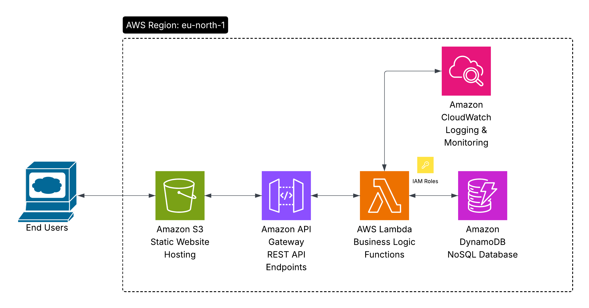

# AWS Serverless Task Management System
## Solutions Architect Associate Project

A simple task management web application built entirely with AWS serverless services. This project demonstrates practical knowledge of AWS architecture patterns required for the Solutions Architect Associate certification.

## Live Demo

**Website:** http://task-management-frontend-saa-project.s3-website.eu-north-1.amazonaws.com

## What This Project Does

This is a full-stack task management application where users can:
- Create new tasks with title, description, and status
- View all tasks with filtering by status (pending, in-progress, completed)  
- Edit existing tasks
- Delete tasks
- See real-time statistics of their tasks

The entire application runs on AWS with no servers to manage.

## Architecture

## AWS Services Used

- **DynamoDB** - Stores all task data in a NoSQL database
- **Lambda** - Four Python functions handle all business logic (create, read, update, delete)
- **API Gateway** - Provides REST API endpoints for the frontend
- **S3** - Hosts the static website (HTML, CSS, JavaScript)
- **CloudWatch** - Monitors and logs everything automatically
- **IAM** - Manages permissions between services

## Why This Architecture Works

**Cost Effective**: The entire application runs for free under AWS free tier limits. Even with heavy usage, costs would be minimal due to pay-per-use pricing.

**Scalable**: Each component scales automatically. If suddenly 1000 users start using the app, AWS handles the load without any configuration changes.

**Secure**: Each Lambda function has only the minimum permissions needed. All data is encrypted and transmitted over HTTPS.

**Reliable**: No single point of failure. If one Lambda execution fails, it doesn't affect others. DynamoDB has automatic backups.

## Technical Implementation

### Backend (Python)
Four Lambda functions handle all operations:
- `createTask` - Validates input and saves new tasks to DynamoDB
- `getTasks` - Retrieves and returns all tasks with proper formatting  
- `updateTask` - Updates existing tasks while preserving data integrity
- `deleteTask` - Safely removes tasks with existence checks

### Frontend (Vanilla JavaScript)
Clean, responsive interface with:
- Real-time API calls to the backend
- Smart pagination (3 tasks per page)
- Status filtering and live statistics
- Error handling and user feedback
- Mobile-friendly design

### Database Design
Simple DynamoDB table with:
- Primary Key: `taskId` (unique identifier)
- Attributes: `title`, `description`, `status`, `createdAt`, `updatedAt`
- No complex relationships needed for this use case

## Project Cost: $0

Everything runs within AWS free tier limits:
- DynamoDB: Under 25GB storage and 25 read/write units
- Lambda: Under 1 million requests per month
- API Gateway: Under 1 million API calls per month
- S3: Under 5GB storage and 20,000 requests per month

## Key Learning Outcomes

Through building this project, I gained hands-on experience with:

**Serverless Architecture**: Understanding when and how to use Lambda functions effectively, including proper error handling and performance optimization.

**API Design**: Creating RESTful APIs with proper HTTP methods, status codes, and CORS configuration for web applications.

**NoSQL Database Management**: Designing efficient data models for DynamoDB and handling reserved keywords and data types properly.

**AWS Service Integration**: Connecting multiple AWS services securely and efficiently, understanding IAM roles and permissions.

**Frontend Development**: Building responsive web applications that consume APIs, handle errors gracefully, and provide good user experience.

**Cost Optimization**: Designing within free tier limits while maintaining functionality and scalability.

## How to Deploy

### Step 1: DynamoDB Table
Create a table named `Tasks` with partition key `taskId` (String).

### Step 2: Lambda Functions  
Deploy the four Python functions in the `lambda-functions/` folder. Attach the `AmazonDynamoDBFullAccess` policy to their execution roles.

### Step 3: API Gateway
Create a REST API with these endpoints:
- `GET /tasks` → getTasks function
- `POST /tasks` → createTask function  
- `PUT /tasks/{id}` → updateTask function
- `DELETE /tasks/{id}` → deleteTask function

Enable CORS and deploy to a stage.

### Step 4: Frontend
Create an S3 bucket, enable static website hosting, add a public read policy, and upload the HTML file. Update the API URL in the JavaScript code.

## About This Project

This project was built as part of my preparation for the AWS Solutions Architect Associate certification. It demonstrates practical understanding of serverless architecture, AWS service integration, and modern web development practices.

**Author**: Sherif Kotb  
**LinkedIn**: https://www.linkedin.com/in/sherif-kotb--/

